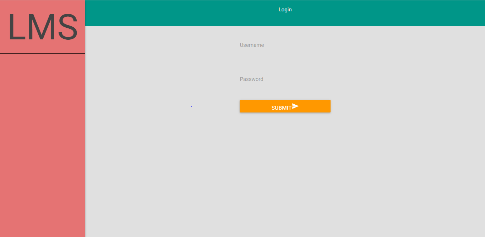

# LeaveManagementSystem
Project done under Software Engineering course at IIT Jodhpur

## Installation
- Downloading and Installing XAMPP
  1. Download XAMPP v5.6 for your operating system from [here] (https://www.apachefriends.org/download.html).
  2. Install XAMPP using the downloaded setup.

- Cloning the repository
  1. Open Terminal (or PowerShell in Windows).
  2. Change your working directory to **htdocs** diretory inside XAMPP installation directory.
  3. Clone this repository in htdocs with following command:  
    `git clone https://github.com/abhimanyusinghgaur/LeaveManagementSystem.git`

- Creating Database in XAMPP
  1. Open **http://localhost/phpmyadmin** in your web-browser.
  2. Click on **New** in the dashboard on left.
  3. Fill **lms** in the database name field.
  4. Click on **Create**.

- Importing Database Schema
  1. **Select** the database **lms** from left dashboard in phpmyadmin.
  2. Click on **Import** button in top navigation bar.
  3. In File to Import section click on **Choose File**.
  4. Select **lms.sql** from the cloned repository and import it.
  5. Go to bottom of page and click on **Go**.

## Getting Started
1. Run XAMPP.
2. In the opening control panel start **Apache** and **MySQL**.
3. Open http://localhost/LeaveManagementSystem/ in your web-browser to run the project.
4. If you want to login as admin, open **http://localhost/LeaveManagementSystem/admin/** in web-browser.  
   Default username and password for admin are:  
   **Username: admin**  
   **Password: admin**
5. Create some Leave Types and then User Types as admin.
6. Then create some users.
7. Default password for the newly created user will be his Username.
8. Open **http://localhost/LeaveManagementSystem/** to log in as a user.

## Contributors
- [Abhimanyu Singh Gaur] (https://github.com/abhimanyusinghgaur)
- [Ashish Sahu] (https://github.com/pikachu97)
- [Ajeet Ujjwal] (https://github.com/ajeet-ujjwal)
- [Daval Pargal] (https://github.com/davalpargal)

## Mentor
- Shreya Goyal
